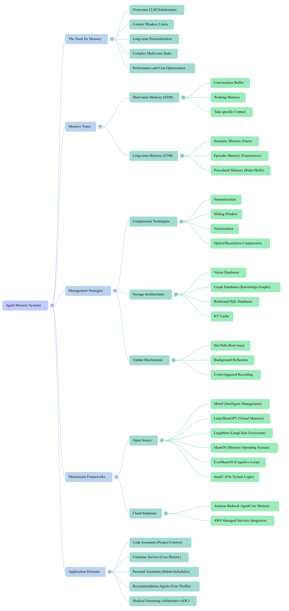
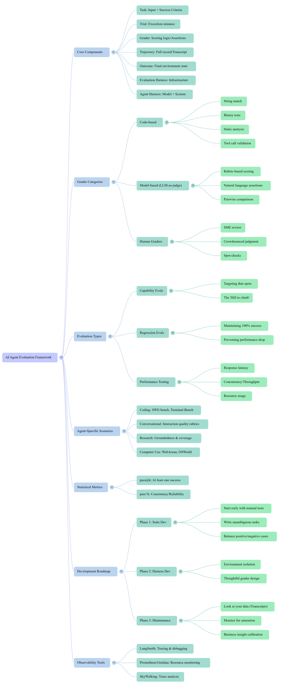

# 📘 Awesome AI Engineering   

####  The Full-Stack LLM Engineering Playbook. 

## 📑 Table of Contents

| 📚 Content                                                       | 🔗 Quick Link                                                 |
|:----------------------------------------------------------------------|:--------------------------------------------------------------|
| Introduction to AI Agents                                             | [🔍 Explore](#introduction-to-ai-agents)                      |
| Building LLMs for Production                                          | [🔍 Explore](#building-llms-for-production)                   |
| Building High-Performance, Private AI Infrastructure for the Enterprise                           | [🔍 Explore](#high-performance-private-ai-infrastructure)           |
| Mastering the Model Context Protocol (MCP)                            | [🔍 Explore](#mastering-the-model-context-protocol)           |
| Agent Memory Part I  (A Survey of Memory)                             | [🔍 Explore](#agent-memory-part-i)                            |
| Agent Memory Part II (Building Memory Modules for Agentic AI Systems) | [🔍 Explore](#building-memory-modules-for-agentic-ai-Systems) |
| Agent Evaluation (Eval) Engineering                                   | [🔍 Explore](#agent-eval)                        |
---
   
  
  
# 📚 Introduction to AI Agents
  
### 🔑 Key Concepts  

### 🧠 Mind Map (Key Concepts)
  [📥 **Download High-Resolution Mind Map** (.jpg)](./summaries/introduction-to-ai-agents/agents-architecture-operations-and-evolution-mindmap.jpg?raw=true)
     

  

    <b><em>🔍 Click here to unfold the full Mind Map (agents-architecture-operations-and-evolution-mindmap.jpg)</em> 
      (点击展开完整思维导图)
    </b>
  
  

  
 

  
  
### 📑 Presentation Slides
> 💡 **Tip:** Press `Ctrl` + `Click` (or Command + Click) to open in a new tab.   
[📥 View the "Introduction to AI Agents" Slides (PDF)](./summaries/introduction-to-ai-agents/agents-architecture-operations-slides.pdf)   
[📥 **Download PDF** (Direct Link)](./summaries/introduction-to-ai-agents/agents-architecture-operations-slides.pdf?raw=true)  
> 
  

### 🚀 Practical Implementation: Task-Oriented AI Agent  
👉 [**View the AI Agent Project in the LLMs-Lab repository on the Eric-LLMs GitHub profile.**](https://github.com/Eric-LLMs/LLMs-Lab/tree/main/Agent/Agent_Project)
  
To bridge theory with practice, I developed a modular AI Agent project that implements autonomous reasoning and task execution:

* **Architecture:** Utilizes a decoupled structure with dedicated directories for `Agent` logic, `Tools`, `Utils`, and `Prompts`.
* **Reasoning Loop:** Features an `AutoGPT.py` implementation using **ReAct (Reasoning and Acting)** logic to handle complex, multi-step goal decomposition.
* **Functional Tools:** Includes custom tools for deep data analysis (Excel processing via Pandas), automated communication via email, PDF-based QA interrogation (**FileQATool**), requirements-driven document generation (**WriterTool**), and dynamic script-based auditing of structured files using custom heuristics and thresholds (**PythonTool**).
* **End-to-End Workflow:** Supports real-world scenarios, such as identifying underperforming suppliers from sales records and autonomously drafting/sending notifications.

  
[⬆️ Back to Top : Table of Contents](#top)  
  
---
   
   
 
# 📚 Building LLMs for Production 

### 🔑 Key Concepts  

### 🧠 Mind Map (Key Concepts)
[📥 **Download High-Resolution Mind Map** (.jpg)](./summaries/building-llms-for-production/building-llms-for-production-mindmap.jpg?raw=true)
   

  

    <b><em>🔍 Click here to unfold the full Mind Map (building-llms-for-production-mindmap.jpg)</em>
      (点击展开完整思维导图)
    </b>
  

  
 

### 📑 Presentation Slides
> 💡 **Tip:** Press `Ctrl` + `Click` (or Command + Click) to open in a new tab.   
[📥 View the "Building LLMs for Production" Slides (PDF)](./summaries/building-llms-for-production/building-llms-for-production-slides.pdf)   
[📥 **Download PDF** (Direct Link)](./summaries/building-llms-for-production/building-llms-for-production-slides.pdf?raw=true)
  

### 🛠️ Hands-on Lab & Examples  
👉 [**Explore Practical LLM Implementations in the LLMs-Lab repository on the Eric-LLMs GitHub profile.**](https://github.com/Eric-LLMs/LLMs-Lab)
  
The production-grade principles discussed in this book—including **Fine-Tuning**, **RAG optimization**, **LangChain**, **Prompt Engineering**, **Function-Calling**, **Agent**, etc.—have each been researched as a standalone module, and each module features multiple project implementations.  
 
[⬆️ Back to Top : Table of Contents](#top)  
  
---
   

   
  
# 📚 Building High-Performance, Private AI Infrastructure for the Enterprise

### 🔑 Key Concepts  

### 🧠 Mind Map (Key Concepts)
[📥 **Download High-Resolution Mind Map** (.jpg)](./summaries/ap.jpg?raw=true)
   

  

    <b><em>🔍 Click here to unfold the full Mind Map (mindmap.jpg)</em>
      (点击展开完整思维导图)
    </b>
  

  
 

### 📑 Presentation Slides
> 💡 **Tip:** Press `Ctrl` + `Click` (or Command + Click) to open in a new tab.   
[📥 View the "Building High-Performance, Private AI Infrastructure for the Enterprise" Slides (PDF)](./summaries/slides.pdf)   
[📥 **Download PDF** (Direct Link)](./summaries/slides.pdf?raw=true)
  

## 🛠️ Hands-on Projects and Examples  

👉 doning ....

[⬆️ Back to Top : Table of Contents](#top)  
  
---
   

   
 
# 📚 Mastering the Model Context Protocol (MCP)  

### 🔑 Key Concepts  

### 🧠 Mind Map (Key Concepts)
[📥 **Download High-Resolution Mind Map** (.jpg)](./summaries/mastering-the-model-context-protocol/mastering-the-model-context-protocol-mindmap.jpg?raw=true)
   

  

    <b><em>🔍 Click here to unfold the full Mind Map (mastering-the-model-context-protocol-mindmap.jpg)</em>
      (点击展开完整思维导图)
    </b>
  

  
 

### 📑 Presentation Slides
> 💡 **Tip:** Press `Ctrl` + `Click` (or Command + Click) to open in a new tab.   
[📥 View the "Mastering the Model Context Protocol (MCP)" Slides (PDF)](./summaries/mastering-the-model-context-protocol/mastering-the-model-context-protocol-slides.pdf)   
[📥 **Download PDF** (Direct Link)](./summaries/mastering-the-model-context-protocol/mastering-the-model-context-protocol-slides.pdf?raw=true)
  

## 🛠️ Hands-on Projects and Examples  

👉 **[Explore Model Context Protocol (MCP) Projects on GitHub](https://github.com/Eric-LLMs/awesome-mcp-servers)** *A curated collection of industry-standard Model Context Protocol (MCP) server implementations.*

[⬆️ Back to Top : Table of Contents](#top)  
  
---
   

   
 
# 📚 Agent Memory Part I 

### 🔑 Key Concepts  

### 🧠 Mind Map (Key Concepts)
[📥 **Download High-Resolution Mind Map** (.jpg)](./summaries/memory-in-the-age-of-ai-agents-survey/unforgettable_agents_architecting_ai_memory-mindmap.jpg?raw=true)
   

  

    <b><em>🔍 Click here to unfold the full Mind Map (unforgettable_agents_architecting_ai_memory-mindmap.jpg)</em>
      (点击展开完整思维导图)
    </b>
  

  
 

### 📑 Presentation Slides   
  
#### A Blueprint for Memory in Agentic Intelligence
> 💡 **Tip:** Press `Ctrl` + `Click` (or Command + Click) to open in a new tab.   
[📥 View the "A Blueprint for Memory in Agentic Intelligence" Slides (PDF)](./summaries/memory-in-the-age-of-ai-agents-survey/a-blueprint-for-memory-in-agentic-intelligence.pdf)   
[📥 **Download PDF** (Direct Link)](./summaries/memory-in-the-age-of-ai-agents-survey/a-blueprint-for-memory-in-agentic-intelligence.pdf?raw=true)
  
#### Unforgettable Agents Architecting AI Memory
> 💡 **Tip:** Press `Ctrl` + `Click` (or Command + Click) to open in a new tab.   
[📥 View the "Unforgettable Agents Architecting AI Memory" Slides (PDF)](./summaries/memory-in-the-age-of-ai-agents-survey/unforgettable_agents_architecting_ai_memory.pdf)   
[📥 **Download PDF** (Direct Link)](./summaries/memory-in-the-age-of-ai-agents-survey/unforgettable_agents_architecting_ai_memory.pdf?raw=true)

### 📑 Further Reading / Resources

For a comprehensive list of papers related to Agent Memory, we highly recommend checking out:  
👉  * [Agent-Memory-Paper-List](https://github.com/Shichun-Liu/Agent-Memory-Paper-List) by Shichun-Liu.

[⬆️ Back to Top : Table of Contents](#top)  
  
---
   

  
   
 
# 📚 Building Memory Modules for Agentic AI Systems
A comprehensive guide on designing memory systems for AI Agents. This document synthesizes academic surveys with practical implementation strategies, covering: * Theory: Taxonomy of agent memory (Forms, Functions, Dynamics). * Frameworks: Deep dive into Mem0, Letta (MemGPT), and LangMem. * Practice: Enterprise-grade solutions using Amazon Bedrock AgentCore  

### 🔑 Key Concepts  

### 🧠 Mind Map (Key Concepts)
[📥 **Download High-Resolution Mind Map** (mindmap.png)](./summaries/building-memory-for-agentic-ai-theory-frameworks-and-practice/building-memory-for-agentic-ai-theory-frameworks-and-practice-mindmap.png?raw=true)
   

  

    <b><em>🔍 Click here to unfold the full Mind Map</em>
      (点击展开完整思维导图)
    </b>
  

  
 

### 📑 Presentation Slides   
  
#### Building Memory for Agentic AI: Theory, Frameworks, and Practice
> 💡 **Tip:** Press `Ctrl` + `Click` (or Command + Click) to open in a new tab.   
[📥 View Slides (PDF)](./summaries/building-memory-for-agentic-ai-theory-frameworks-and-practice/building-memory-for-agentic-ai-theory-frameworks-and-practice.pdf)   
[📥 **Download PDF** (Direct Link)](./summaries/building-memory-for-agentic-ai-theory-frameworks-and-practice/building-memory-for-agentic-ai-theory-frameworks-and-practice.pdf?raw=true)

### 📑 Key Frameworks & Code Samples

The following frameworks and repositories are discussed in this guide, representing the current state-of-the-art in Agentic Memory:  
* **[Mem0](https://github.com/mem0ai/mem0)**: A dual-layer memory framework supporting working, factual, and semantic memory types for agent state persistence.
* **[Letta (MemGPT)](https://github.com/letta-ai/letta)**: Manages infinite context by treating agents like an OS with virtual memory and recursive summarization.
* **[LangMem](https://github.com/langchain-ai/langmem)**: A LangChain library that implements Semantic, Episodic, and Procedural memory integration for LangGraph agents.
* **[Amazon Bedrock Samples](https://github.com/aws-samples/amazon-bedrock-samples)**
  Comprehensive collection of examples for using Amazon Bedrock, including various implementations of Agentic workflows and memory patterns.  
  
[⬆️ Back to Top : Table of Contents](#top)  
  
---
   

   
  
# 📚 Agent Evaluation (Eval) Engineering

> *"In the age of Agents, your product is only as good as your ability to measure it."*

Evaluating AI Agents requires a fundamental shift from simple output checks ("vibe checks") to analyzing multi-step trajectories, environment changes, and tool usage. This repository consolidates frameworks and engineering practices for moving from **intuition to instrumentation**.

It synthesizes industry standards from Anthropic, LangChain, and real-world engineering practices to build a robust **Evaluation Harness**.

---

### 🔑 Key Concepts
* **The Intuition Trap**: Why manual "vibe checks" fail as complexity scales.
* **The Harness**: Building a standardized environment for agent execution composed of Inputs, Tasks, and Graders.
* **Trajectory vs. Outcome**: Evaluating the *journey* (reasoning logs, tool calls) rather than just the *destination* (final answer).
* **Reliability Metrics**:
    * **Pass@k (Creativity)**: Can the agent succeed *at least once* in k tries? (Good for brainstorming).
    * **Pass^k (Reliability)**: Can the agent succeed *every single time* in k tries? (Critical for autonomous agents).
* **Swiss Cheese Model**: Layering defenses (Automated Evals → Human Review → Production Monitoring) to ensure reliability.

---

### 🧠 Mind Map (Framework Overview)
[📥 **Download High-Resolution Mind Map** (mindmap.png)](./summaries/agent-evaluation/ai-agent-evaluation-framework.png?raw=true)
   

  

    <b><em>🔍 Click here to unfold the full Mind Map</em>
      (点击展开完整思维导图)
    </b>
  

  
 

---

### 📑 Presentation Slides
A Comprehensive Guide to Evaluating AI Agents Focuses on the engineering framework for testing, including the "Clean Room" methodology, reliability metrics (Pass@k), and the "Harness" architecture. It treats evaluation as a core development practice.

> 💡 **Tip:** Press `Ctrl` + `Click` (or Command + Click) to open in a new tab.   
[📥 View Slides (PDF)](./summaries/agent-evaluation/agent-evaluation-engineering.pdf)   
[📥 **Download PDF** (Direct Link)](./summaries/agent-evaluation/agent-evaluation-engineering.pdf?raw=true)

---

### 🛠️ Key Frameworks & Code Samples

#### 1. The Tooling Stack (Ecosystem)
Implementing a robust evaluation pipeline requires specific infrastructure. The following tools are referenced and utilized in this framework:

| Tool | Category | Key Features |
| :--- | :--- | :--- |
| **[LangSmith](https://smith.langchain.com/)** | Tracing & Debugging | Full trajectory tracing, `runnableConfig` tagging for A/B testing, and dataset management. |
| **[LangFuse](https://langfuse.com/)** | Observability | Open-source alternative for observability, prompt management, and lightweight evaluation. |
| **[DeepEval](https://github.com/confident-ai/deepeval)** | Unit Testing | "Pytest for LLMs". Specific metrics for RAG (Hallucination, Answer Relevancy) and Agents. |
| **[OpenEvals](https://github.com/langchain-ai/openevals)** | Graders | A library of pre-built "LLM-as-a-judge" prompts (Conciseness, Correctness, Coherence) compatible with LangSmith. |

#### 2. Architecture: Hybrid Agent (Fast vs. Slow)
To balance cost and performance, we implement a **Hybrid Agent Architecture**:
* **Reactive Layer (System 1)**: Handles simple, direct queries (e.g., "What is the stock price?") with low latency.
* **Deliberative Layer (System 2)**: Activated for complex planning or multi-step reasoning tasks.
* **Coordination Layer**: A router that classifies intent and dispatches tasks.

#### 3. Evaluation Strategy: The "Clean Room"
To prevent "cheating" through shared state, every evaluation trial runs in a fresh container/sandbox.
* **Isolation**: Fresh container for every trial.
* **Mocking**: Simulate external APIs to control latency and deterministic outputs.
* **Cleanup**: Aggressive state teardown (no shared history).

[⬆️ Back to Top : Table of Contents](#top)

